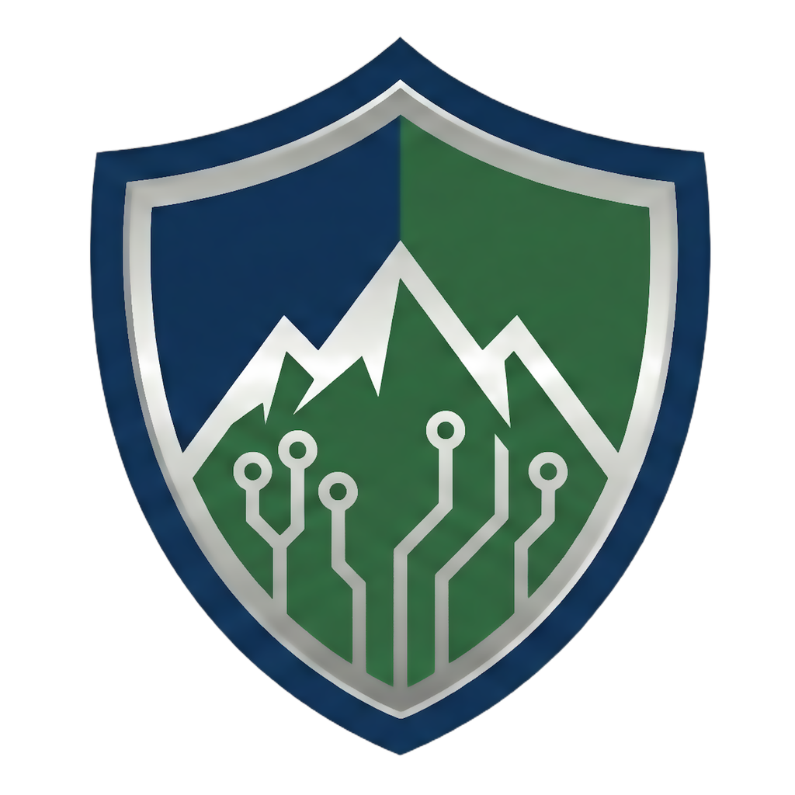

<p align="center">
  <br><br>
  <b>Secure remote support by Southern Colorado Systems, LLC</b>
</p>

# SoCo Systems Sentry — Relay Server

The relay server behind **[SoCo Systems Sentry](https://sentry.socosystems.net)**,
the branded remote-support tool used by **Southern Colorado Systems, LLC**. It is
a fork of [rustdesk-server](https://github.com/rustdesk/rustdesk-server) — the
`hbbs` rendezvous/ID server and `hbbr` relay — with a **default-deny device
authorization** layer added.

> [!IMPORTANT]
> **Authorized use only.** This server and the service it powers are operated
> solely for Southern Colorado Systems and its authorized clients. Unauthorized
> use, access, or distribution is prohibited. This repository is published for
> source transparency and AGPL-3.0 license compliance.

## What this fork adds

- **Blocked by default (zero-trust).** `hbbs` consults an allowlist and refuses
  registration and connection for any device that has not been explicitly
  authorized in SoCo Systems' management console. A device that merely runs a
  Sentry client cannot come online or be reached until it is enabled.
- **Fail-safe by design.** The enforcement layer is written so that neither an
  outage of the management side nor a relay restart can silently open the fleet
  up or lock authorized devices out — the last known authorization set is kept.
- **Drop-in image.** Published as `ghcr.io/socosys/sentry-server`, a direct
  replacement for the stock `rustdesk/rustdesk-server` image (`hbbs` + `hbbr`),
  built statically from `Dockerfile.soco`. The added logic lives in an isolated
  module to keep upstream rebases clean.

Key enforcement is preserved from upstream (clients validate the server by its
public key), so switching the image in or out requires no client re-keying.

## Building

The container image is built and published to GHCR by CI on a version tag.
For a local build, standard Rust tooling applies:

```bash
cargo build --release
```

which produces `hbbs`, `hbbr`, and `rustdesk-utils` in `target/release`, exactly
as upstream.

## License & attribution

This project is a derivative work of
**[rustdesk-server](https://github.com/rustdesk/rustdesk-server)** and is
distributed under the **GNU AGPL-3.0** license, the same license as the upstream
project. All RustDesk trademarks and copyrights remain with their respective
owners; "SoCo Systems Sentry" branding belongs to Southern Colorado Systems, LLC.
